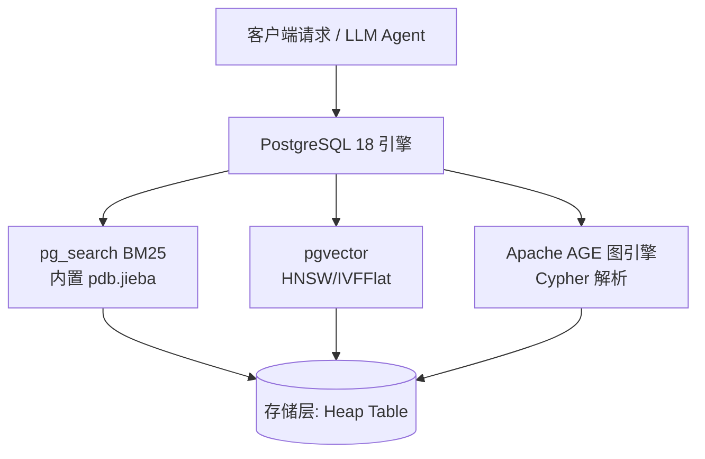

# PG-RAG-FULL: 一站式 AI 多模态数据库环境

## 项目简介

`pg-rag-full` 是一个开箱即用的 PostgreSQL 18 环境，专为 AI 应用（如 RAG、知识图谱匹配、混合检索）优化。基于 [ParadeDB](https://github.com/paradedb/paradedb) 镜像构建，在单个容器内集成三大核心能力：

- **pgvector**: 向量相似度搜索（HNSW、IVFFlat）
- **ParadeDB pg_search**: 基于 Tantivy 的 BM25 全文检索，**内置 pdb.jieba 中文分词器**
- **Apache AGE**: 强大的图数据库，支持 Cypher 查询语法

## 快速启动

```bash
# 首次构建并启动容器
docker compose up -d --build

# 查看运行日志
docker compose logs -f

# 连接数据库
docker compose exec postgres psql -U postgres
```

默认凭据：`postgres` / `postgres`，端口 `5432`。

> **⚠️ 重要提示**: `init.sql` 脚本**仅在首次启动容器（数据卷为空时）**自动执行。若需重新初始化，必须先清理数据卷：
> ```bash
> docker compose down -v
> docker compose up -d --build
> ```

## 验证运行状态

连接 psql 后，可执行以下命令检查各组件：

```sql
-- 检查所有扩展是否已安装
SELECT extname, extversion FROM pg_extension;

-- 测试 Jieba 分词器是否正常工作
SELECT '你好世界'::pdb.jieba::text[];

-- 检查图数据库引擎
SELECT * FROM ag_catalog.ag_graph;
```

## 核心组件使用指南

### 1. 向量相似度搜索 (pgvector)

```sql
-- 建表与数据导入
CREATE TABLE items (
    id SERIAL PRIMARY KEY,
    embedding VECTOR(3),
    name TEXT
);
INSERT INTO items (embedding, name) VALUES
    ('[1,2,3]', '项目A'),
    ('[4,5,6]', '项目B');

-- 创建 HNSW 索引以加速向量检索
CREATE INDEX idx_vec_hnsw ON items USING hnsw (embedding vector_cosine_ops);

-- 执行向量相似度查询
-- 余弦距离查询 (<=>)
SELECT name, embedding <=> '[3,3,3]' AS cosine_dist
FROM items
ORDER BY cosine_dist
LIMIT 5;
```

### 2. 中文全文检索 (ParadeDB pg_search + Jieba)

> **重要**: 必须使用 `::pdb.jieba` 强制类型转换来调用中文分词器。

#### 2.1 Jieba 分词器说明

Jieba 是一款基于**词典 + 统计模型**的中文分词器，相比 Lindera 等分词器：
- **优势**：对模糊的中文词边界识别更准确
- **劣势**：分词速度相对较慢

可使用以下命令快速验证分词效果：

```sql
-- 测试分词结果（会返回分词后的词数组）
SELECT 'Hello world! 你好!'::pdb.jieba::text[];
-- 返回: {hello," ",world,!," ",你好,!}

SELECT '自然语言处理是人工智能的重要分支'::pdb.jieba::text[];
-- 返回: {自然语言,处理,是,人工智能,的,重要,分支}
```

#### 2.2 BM25 索引创建

```sql
-- 创建文章表
CREATE TABLE articles (
    id SERIAL PRIMARY KEY,
    title TEXT,
    content TEXT
);

-- 创建 BM25 索引（使用 jieba 分词器）
-- key_field: 指定索引的主键字段
-- 索引会自动维护，无需手动重建
CREATE INDEX idx_bm25_jieba ON articles USING bm25 (
    id,
    (title::pdb.jieba),
    (content::pdb.jieba)
) WITH (key_field = 'id');
```

#### 2.3 查询操作符详解

```sql
-- 模糊匹配查询（使用 @@@ 操作符）
-- 适用于前缀匹配、拼写纠错等场景
SELECT id, title, pdb.score(id)
FROM articles
WHERE title @@@ 'Postgre';

-- OR 关系查询（使用 ||| 操作符）
-- 匹配任意关键词，返回相关性分数
SELECT id, title, pdb.score(id)
FROM articles
WHERE content::pdb.jieba ||| '数据库 搜索'
ORDER BY pdb.score(id) DESC;

-- AND 关系查询（使用 &&& 操作符）
-- 必须同时包含所有关键词
SELECT id, title
FROM articles
WHERE content::pdb.jieba &&& '数据';

-- 提取高亮匹配片段（用于展示搜索关键词上下文）
SELECT pdb.snippet(content::pdb.jieba, '<mark>', '</mark>') AS highlight
FROM articles
WHERE content::pdb.jieba ||| '搜索';
```

#### 2.4 索引维护与重建

当表结构发生变化（新增/删除列）或需要优化索引性能时：

```sql
-- 重建指定索引（保留原有配置）
REINDEX INDEX idx_bm25_jieba;

-- 或者重建并指定新配置
DROP INDEX idx_bm25_jieba;
CREATE INDEX idx_bm25_jieba ON articles USING bm25 (
    id,
    (title::pdb.jieba),
    (content::pdb.jieba)
) WITH (key_field = 'id');
```

> **注意**: 日常的 INSERT、UPDATE、DELETE 操作会**自动维护** BM25 索引，无需手动干预。

### 2.5 与 PostgreSQL 主库配合（逻辑复制模式）

在生产环境中，可将 ParadeDB 作为 PostgreSQL 主库的**逻辑订阅者**，实现搜索流量与 OLTP 流量分离：

```
┌─────────────────┐    逻辑复制    ┌────────────────────┐
│   PostgreSQL    │ ────────────→ │ ParadeDB (订阅者)  │
│   主库 (OLTP)   │   INSERT/     │ - BM25 全文索引    │
│                 │   UPDATE/     │ - 向量相似度搜索   │
│                 │   DELETE      │ - 图数据库查询     │
└─────────────────┘               └────────────────────┘
       业务写入                          搜索查询
```

#### 2.5.1 基础工作流程

```sql
-- 步骤1: 等待初始复制完成
-- 检查复制状态：worker_type = 'table synchronization' 表示正在同步
SELECT
    subname,                    -- 订阅名称
    worker_type,                -- 工作类型：table sync / apply
    CASE WHEN relid = 0
         THEN NULL
         ELSE relid::regclass   -- 表名
    END AS table_name,
    latest_end_time             -- 最新同步时间
FROM pg_stat_subscription
ORDER BY 1, 2, 3;

-- 更严格的检查：每个表的状态应为 'r' (ready)
SELECT srrelid::regclass AS table_name, srsubstate
FROM pg_subscription_rel
WHERE srsubstate != 'r'  -- 筛选未就绪的表
ORDER BY 1;
```

```sql
-- 步骤2: 初始复制完成后，在 ParadeDB 上构建 BM25 索引
-- 注意：不要在复制过程中提前建索引，会增加额外开销
CREATE INDEX idx_articles_bm25 ON public.articles USING bm25 (
    id,
    (title::pdb.jieba),
    (content::pdb.jieba)
) WITH (key_field = 'id');

-- 步骤3: 验证索引正常工作
SELECT id, title, pdb.score(id)
FROM articles
WHERE content::pdb.jieba ||| '关键词'
LIMIT 5;
```

#### 2.5.2 日常运维操作

```sql
-- 添加新表到复制
-- 1. 在主库和 ParadeDB 同时执行 DDL
-- 2. 在主库更新发布（publication）
ALTER PUBLICATION app_search_pub ADD TABLE public.new_table;
-- 3. 刷新订阅以触发初始同步
ALTER SUBSCRIPTION app_search_sub REFRESH PUBLICATION;
-- 4. 新表就绪后构建 BM25 索引
CREATE INDEX idx_new_table_bm25 ON public.new_table USING bm25 (
    id,
    (content::pdb.jieba)
) WITH (key_field = 'id');

-- 修改索引列（新增/删除索引字段）
-- 1. 主库和 ParadeDB 同时修改表结构
-- 2. 等待复制追平
-- 3. 重建 BM25 索引
REINDEX INDEX idx_articles_bm25;
```

#### 2.5.3 复制参数调优建议

对于大型或高频变更的生产表，建议为每张大表配置独立的订阅：

```bash
# 主库 (PostgreSQL) 配置
max_replication_slots = 订阅数量 × 1.5  # 预留初始同步时的额外槽位
max_wal_senders = max_replication_slots + 物理复制副本数

# ParadeDB (订阅者) 配置
max_replication_slots = 订阅数量 + 初始同步工作进程数
max_logical_replication_workers = 订阅数量 × 2  # 每订阅至少 1 个应用进程 + 1 个同步进程
max_sync_workers_per_subscription = 4  # 提高初始复制并行度
max_worker_processes = 逻辑复制工作进程数 + 系统背景进程数
```

> **关键提示**: PostgreSQL 逻辑复制**不会**自动同步 DDL 变更，必须在主库和订阅库**分别手动执行**相同的 DDL 语句。

### 3. 图数据库查询 (Apache AGE)

```sql
-- 创建图
SELECT create_graph('sample_graph');

-- 使用 Cypher 语法创建节点
SELECT * FROM cypher('sample_graph', $$
    CREATE (p:AI {name: '大模型', parameter: '70B'})
    RETURN p
$$) AS (v agtype);

-- 使用 Cypher 语法查询节点
SELECT * FROM cypher('sample_graph', $$
    MATCH (n:AI)
    RETURN n.name
$$) AS (name agtype);
```

## 实战场景：RAG 混合检索

### 场景一：BM25 + 向量语义混合检索（RRF 融合）

基于倒数秩融合算法（Reciprocal Rank Fusion），将精准的关键词搜索与模糊的语义理解结合：

```sql
WITH
    -- 1. 基于 jieba 的全文精确检索
    fulltext AS (
        SELECT id, ROW_NUMBER() OVER (ORDER BY pdb.score(id) DESC) AS rank
        FROM articles
        WHERE content::pdb.jieba ||| '中文数据库'
        LIMIT 20
    ),
    -- 2. 基于语义向量的检索
    semantic AS (
        SELECT id, ROW_NUMBER() OVER (ORDER BY embedding <=> '[0.12, 0.45, 0.78]'::vector) AS rank
        FROM articles
        LIMIT 20
    ),
    -- 3. RRF 计算与融合
    rrf AS (
        SELECT id, 1.0 / (60 + rank) AS score FROM fulltext
        UNION ALL
        SELECT id, 1.0 / (60 + rank) AS score FROM semantic
    )
-- 结果汇总并按混合分数降序
SELECT a.id, a.title, a.content, SUM(rrf.score) AS hybrid_score
FROM rrf
JOIN articles a USING (id)
GROUP BY a.id, a.title, a.content
ORDER BY hybrid_score DESC
LIMIT 5;
```

### 场景二：图数据库 + 向量搜索（GraphRAG 基础）

利用 PostgreSQL 将图谱与关系型表结合，实现"沿着知识图谱走一层，再做语义召回"：

```sql
-- 假设 entity_docs 表存储向量和文本数据
-- 从图谱中查询特定关联的实体，然后在关联文档上做向量搜索
WITH connected_entities AS (
    SELECT agtype_to_int8(id) AS parsed_id
    FROM cypher('sample_graph', $$
        MATCH (a:Person {name: '李四'})-[r:KNOWS]->(b:Person)
        RETURN b.id
    $$) AS (id agtype)
)
SELECT d.title,
       d.embedding <=> '[0.3, 0.5, 0.7]'::vector AS vec_score
FROM entity_docs d
JOIN connected_entities c ON d.id = c.parsed_id
ORDER BY vec_score ASC
LIMIT 5;
```

## 数据库初始化与自定义脚本

项目核心扩展的初始化脚本位于 `init.sql`，在容器首次启动时自动执行。

若需添加自定义的建表或数据导入脚本：

1. **单文件挂载**：请将脚本作为单文件挂载，**不要**覆盖整个 `/docker-entrypoint-initdb.d/` 目录
2. **命名规范**：核心脚本前缀为 `00-`，请使用 `10-`、`99-` 等前缀确保执行顺序

```yaml
# docker-compose.yml 示例
services:
  postgres:
    volumes:
      # - ./init.sql:/docker-entrypoint-initdb.d/00-core-init.sql:ro    # 已经打包到 Dockerfile 中
      - ./my-business.sql:/docker-entrypoint-initdb.d/99-business.sql:ro
```

> **升级提示**: 已有数据卷的用户可安全升级镜像，PostgreSQL 会自动跳过已执行的初始化脚本。

## 架构概览



## 参考资料

- [ParadeDB 官方文档](https://docs.paradedb.com)
- [ParadeDB 逻辑复制操作指南](https://docs.paradedb.com/deploy/logical-replication/operational-guide)
- [pgvector GitHub](https://github.com/pgvector/pgvector)
- [Apache AGE 官方手册](https://age.apache.org/)
